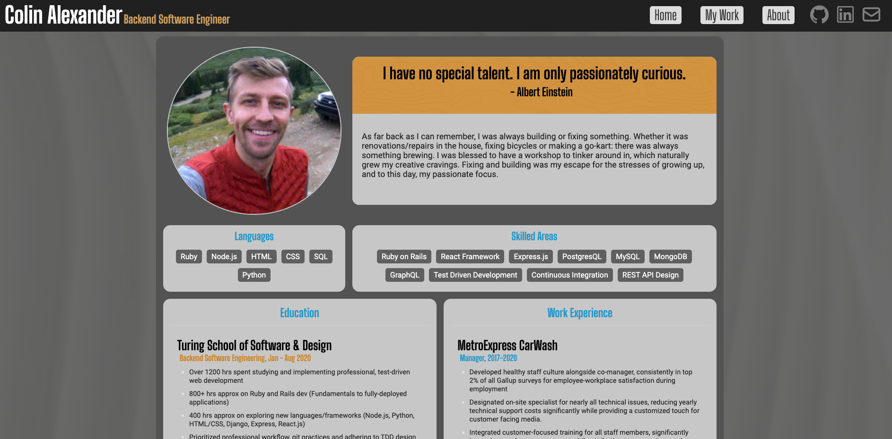

# README

## Personal Portfolio Website

#### Ruby on Rails App with PostgresQL, displaying on React w/ Webpack. TDD using RSpec/Capybara.
#### Deployed live on Ubuntu v20 remote server, www.colinalex.com

  

## What It's About 
The ultimate goal of this app was to flex my current skills at the time. I just recently graduated from Turing School of Software & Design, and I have a diverse exposure to graphic design so I thought what better than a fullstack app for a portfolio site!?

Instead of branching off to a newer language or framework, I decided to stick with Rails since it's my foundation of learning. I've recently experimented with some other React front end projects, and I thought this would be the perfect stage for an attempt at making something pretty decent, entirely on my on. 

## Challenges
- Integrating ReactRouterDOM inside a Rails environment, I spend a good amount of time tackling route errors and making sure routes were acceesible but not tangled.
- Deploying the application to an Ubuntu server. This required a rapid understanding of SSH, logging into the server, as well as Nginx configuration.
- ActiveStorage and Remote Images, local disk would always work but I had to learn about certain server architecture to know that Heroku does not allow local disk storage. 
- CSS/UI Design. While the code wasn't something new to me, delivering something that's visually appealing while also remaining functional was a challenge.  

## Wins
- First ever application deployed to production, on it's own server. Ton's of greating learning experiences.
- I'm proud of it.. That's big. 
- I've gained an appreciation and a greater perspective on web development. I learned about services and concepts I didn't know existed!

## Future Goals
- GitHub integration, I'm interested to see if I can relay my Activity Monitor and a seperate list of repositories
- Pagination and possibly tighter arangements for project modules in the work page.
- Medium integration? I'll need to research some more.
